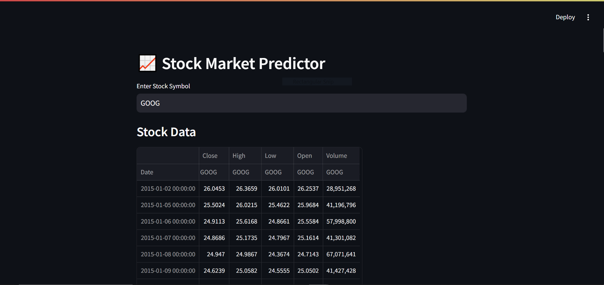
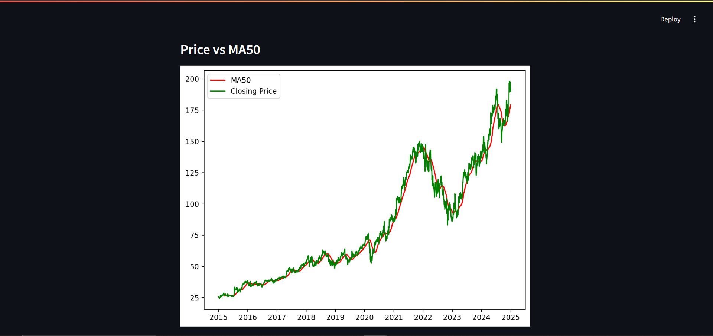
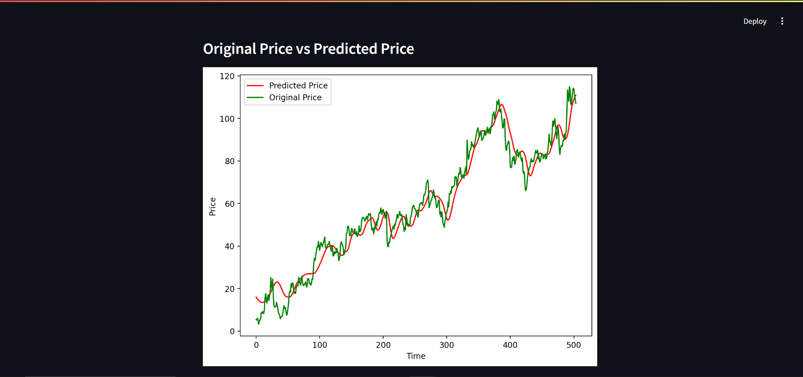
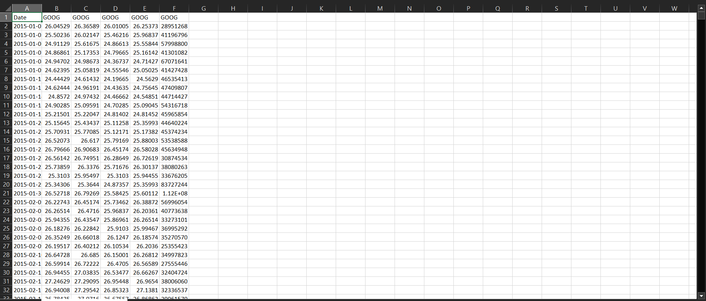

# 📈 Stock Price Predictor

Predict tomorrow’s price today.  
A lightweight Streamlit app that deploys an LSTM-based deep-learning model to forecast daily OHLC + volume for any stock, with decade-long historical coverage (2015 – 2024) and crystal-clear charting.

---

## 📚 Table of Contents
<ul>
  <li><a href="#key-features">Key Features</a></li>
  <li><a href="#live-demo">Live Demo</a></li>
  <li><a href="#quickstart-local">Quickstart&nbsp;(Local)</a></li>
  <li><a href="#project-structure">Project Structure</a></li>
  <li><a href="#screenshots">Screenshots</a></li>
  <li><a href="#contributing">Contributing</a></li>
  <li><a href="#author">Author</a></li>
</ul>

---

<a id="key-features"></a>
## ✨ Key Features
| 🚀 | Description |
|----|-------------|
| **End-to-end ML pipeline** | `yfinance` data → scaled preprocessing → LSTM + Dense + Dropout → saved weights (`Stock Prediction Model.Keras`) → interactive dashboard |
| **10-year horizon** | Instant report on open, high, low, close & volume across 2015 – 2024 |
| **One-click symbol search** | Enter any ticker (`AAPL`, `TSLA`, `NSE:TCS`) and receive predictions |
| **Downloadable report** | Auto-generate an Excel report containing daily stock data |
| **Rich visual analytics** | • Price vs 50-day MA<br>• 50/100/200-day crossovers<br>• Actual vs Predicted curve |
| **Pure Python stack** | TensorFlow · Keras · Pandas · NumPy · Matplotlib · Streamlit |

---

<a id="live-demo"></a>
## 🚀 Live Demo
» **Try it on Render →** https://stock-price-predictor-1xoo.onrender.com/

---

<a id="quickstart-local"></a>
## 🖥️ Quickstart (Local)

```bash
# 1. Clone
git clone https://github.com/Atharva-U-Tripathi/stock-price-predictor.git
cd stock-price-predictor

# 2. Create env & install deps
python -m venv .venv
source .venv/bin/activate          # Windows: .venv\Scripts\activate
pip install -r requirements.txt

# 3. Launch the app
streamlit run app.py

# 4. Browse
http://localhost:8501
```

> ⚡ **First-launch note:** The pre-trained weights in `Stock Prediction Model.Keras` load in seconds.  
> If you delete that file, the app will train from scratch (≈ 2–3 min on CPU).

---

<a id="project-structure"></a>
## 📂 Project Structure
```text
├─ app.py
├─ Stock Prediction Model.Keras
├─ requirements.txt
└─ README.md
```

---

<a id="screenshots"></a>
## 🖼️ Screenshots

| View | Preview |
|------|---------|
| **Landing Dashboard** |  |
| **Price vs 50-day MA** |  |
| **Actual vs Predicted** |  |
| **Excel Report** |  |

---

<a id="contributing"></a>
## 🤝 Contributing
1. Fork → clone → `git checkout -b feature/<name>`  
2. Implement your change, write clear commit messages.  
3. If you touch ML code, include before/after metrics.  
4. Open a Pull Request.

---

<a id="author"></a>
## 🙋‍♂️ Author
**Atharva U. Tripathi** — [GitHub](https://github.com/Atharva-U-Tripathi)
